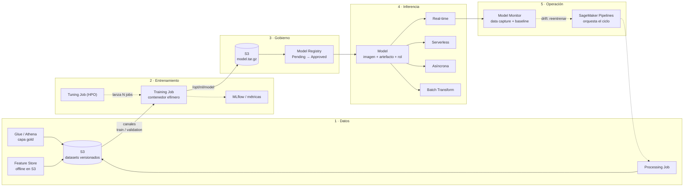

# Workshop autoguiado: Amazon SageMaker AI

Pensado para alguien que ya domina S3, Glue, Athena y Bedrock. El caso que usamos de hilo conductor es **predecir los kWh de una sesión de carga** con datos de la capa gold. Puedes cambiarlo por cualquier problema tabular tuyo.

| Módulo | Contenido | Tiempo |
|---|---|---|
| 0 | Preparación del entorno | 30 min |
| 1 | Qué es SageMaker hoy (y qué no es) | 20 min |
| 2 | El modelo mental: jobs, contenedores, S3, IAM | 45 min |
| 3 | Datos para training en S3 | 60 min |
| 4 | Training | 60 min |
| 5 | Registro y gobierno de modelos | 15 min |
| 6 | Inferencia | 75 min |
| 7 | MLOps y monitorización | 30 min |
| 8 | GenAI: SageMaker vs Bedrock | 20 min |
| 9 | Seguridad, costes y errores típicos | 20 min |
| Labs | 1 a 7, hands-on | 3–4 h |

### Contenido de esta carpeta

```text
sagemaker-workshop/
├── README.md                  # este documento (teoría + código de referencia de los labs)
├── flujo-end-to-end.mmd       # diagrama del ciclo completo
├── requirements.txt           # entorno local
└── labs/
    ├── config.py              # rellena rol, bucket y región
    ├── workshop_labs.ipynb    # labs 1 a 7 ejecutables, en orden
    └── src/
        ├── train.py           # script de training del Lab 3
        └── requirements.txt   # dependencias extra dentro del contenedor
```

Arranque rápido:

```bash
python3.12 -m venv .venv && source .venv/bin/activate
pip install -r requirements.txt ipykernel
# edita labs/config.py y abre labs/workshop_labs.ipynb
```

Con `USE_SYNTHETIC = True` (por defecto en `config.py`) el Lab 1 genera sesiones de carga ficticias, así que no necesitas ninguna tabla gold.

### Diagrama del ciclo



---

## Módulo 0 · Preparación

- Usa una **cuenta dev** y una región fija (p. ej. `eu-west-1`). Bucket, jobs y endpoints deben estar en la **misma región**.
- Python 3.10+ y `pip install "sagemaker>=3,<4" boto3 awswrangler` (fija la versión exacta en tu `requirements.txt` cuando la instales).
- **Rol de ejecución** (lo asume SageMaker, no tú): trust policy para `sagemaker.amazonaws.com`, lectura/escritura en tu bucket, pull de ECR, CloudWatch Logs y KMS si cifras. Para el workshop vale `AmazonSageMakerFullAccess` + política de tu bucket.
- **Tu usuario** necesita `iam:PassRole` sobre ese rol. Es el error número uno.
- Puedes trabajar **desde local** (Kiro/VS Code). Studio es opcional. Fuera de SageMaker, `get_execution_role()` no funciona: pasa el ARN del rol a mano.

> **SDK v3 vs v2.** El SDK v3 sustituye `Estimator`, `Model` y `Predictor` por `ModelTrainer` y `ModelBuilder`. Casi todos los blogs y notebooks que encontrarás siguen siendo v2. Chuleta de traducción:
>
> | v2 | v3 |
> |---|---|
> | `Estimator(...).fit({"train": s3})` | `ModelTrainer(...).train(input_data_config=[InputData(...)])` |
> | `PyTorch`, `SKLearn`, `XGBoost`... | `ModelTrainer` con `training_image` |
> | `estimator.deploy()` → `Predictor` | `ModelBuilder(model=trainer).deploy()` → `Endpoint` |
> | `predictor.predict(x)` | `endpoint.invoke(body=..., content_type=...)` |
> | `sagemaker.image_uris.retrieve` | `sagemaker.core.image_uris.retrieve` |
> | `instance_type="ml.m5.xlarge"` | `Compute(instance_type="ml.m5.xlarge")` |
>
> Por debajo los dos llaman a la **misma API** (`CreateTrainingJob`, `CreateEndpoint`...). Por eso en los labs usamos también boto3: lo que aprendes ahí no caduca con el SDK.

---

## Módulo 1 · Qué es SageMaker hoy

Desde finales de 2024 el nombre "SageMaker" cubre dos cosas:

| Producto | Qué es | Cuándo te importa |
|---|---|---|
| **Amazon SageMaker AI** | El SageMaker "clásico" renombrado: training, inferencia, HyperPod, Pipelines, JumpStart, Studio... | Es de lo que trata este workshop |
| **Amazon SageMaker (next gen) / Unified Studio** | Entorno unificado de datos + analítica + IA: catálogo, gobierno, lakehouse, SQL, notebooks, y dentro también SageMaker AI | Si tu organización quiere un único portal gobernado para datos e IA |
| **Amazon Bedrock** (para comparar) | Modelos fundacionales por API, serverless, agentes (AgentCore) | Consumir LLMs sin gestionar infra |

### Mapa de componentes por fase

| Fase | Componente | Para qué lo usarías |
|---|---|---|
| Preparar | **Processing Jobs** | Feature engineering o evaluación como paso de un pipeline ML (sklearn, Spark, tu contenedor) |
| | **Feature Store** | Features reutilizables: *online* (lookup ms en inferencia) y *offline* (S3/Athena para training sin fugas temporales) |
| | **Data Wrangler (en Canvas)** | Preparación visual de datos |
| | **Ground Truth** | Etiquetado humano |
| Entrenar | **Training Jobs** | Entrenar en instancias efímeras que se apagan solas |
| | **Automatic Model Tuning** | Búsqueda de hiperparámetros (bayesiana, random, grid, hyperband) |
| | **HyperPod** | Clústeres persistentes y resilientes (Slurm/EKS) para entrenar modelos grandes durante semanas |
| | **JumpStart** | Hub de modelos preentrenados (open source y propietarios) para desplegar o hacer fine-tuning |
| | **Canvas / Autopilot** | AutoML sin código |
| | **MLflow gestionado / Experiments** | Tracking de runs, métricas y artefactos |
| Gobernar | **Model Registry** | Versionado y aprobación de modelos |
| | **Model Cards, Clarify** | Documentación, sesgo y explicabilidad (SHAP) |
| Desplegar | **Endpoints, Batch Transform** | Las 4 opciones de inferencia (módulo 6) |
| | **Inference Recommender** | Pruebas de carga para elegir tipo de instancia |
| Operar | **Model Monitor** | Drift de datos, calidad de modelo, sesgo, atribución de features |
| | **Pipelines, Projects** | Orquestación y CI/CD de ML |

---

## Módulo 2 · El modelo mental

Si te quedas con una idea, que sea esta:

> **Casi todo en SageMaker AI es un contenedor Docker que corre en instancias gestionadas, lee de S3, escribe en S3 y actúa con un rol IAM.**
> Training, Processing y Batch Transform son efímeros (se apagan solos). Un endpoint es lo mismo, pero persistente y con un servidor HTTP delante.

Es muy parecido a un Glue job: tú das código + configuración, AWS levanta la infraestructura, ejecuta y la libera.

### El contrato del contenedor de training (`/opt/ml`)

```text
/opt/ml/
├── input/
│   ├── config/
│   │   ├── hyperparameters.json     # tus hiperparámetros
│   │   ├── inputdataconfig.json     # definición de canales
│   │   └── resourceconfig.json      # hosts, para training distribuido
│   └── data/
│       ├── train/                   # canal "train"      ← S3
│       └── validation/              # canal "validation" ← S3
├── model/                           # lo que escribas aquí → s3://.../output/model.tar.gz
├── output/
│   ├── data/                        # extras → output.tar.gz
│   └── failure                      # mensaje de error si el job falla
└── checkpoints/                     # se sincroniza con S3 (clave para Spot)
```

Variables de entorno útiles en los contenedores de framework:

| Variable | Valor |
|---|---|
| `SM_CHANNEL_<NOMBRE>` | Ruta local del canal, p. ej. `SM_CHANNEL_TRAIN=/opt/ml/input/data/train` |
| `SM_MODEL_DIR` | `/opt/ml/model` |
| `SM_OUTPUT_DATA_DIR` | `/opt/ml/output/data` |
| `SM_HPS` | Hiperparámetros como JSON (también llegan como `--arg valor`) |
| `SM_NUM_GPUS`, `SM_HOSTS`, `SM_CURRENT_HOST` | Info de recursos para distribuido |

### El contrato del contenedor de inferencia

- Escucha en el puerto **8080**.
- `GET /ping` → 200 si está sano. `POST /invocations` → predicción.
- El `model.tar.gz` se descomprime en `/opt/ml/model` antes de arrancar.

### Tres formas de llevar tu código

| Opción | Qué aportas | Cuándo |
|---|---|---|
| **Algoritmo built-in** (XGBoost, Linear Learner, K-Means, Random Cut Forest, DeepAR...) | Solo datos e hiperparámetros | Problemas estándar, quieres ir rápido |
| **Framework container + script mode** (PyTorch, TensorFlow, sklearn, HuggingFace) | Un `train.py` (y `inference.py`) | El 80% de los casos reales |
| **BYOC** (bring your own container) | Tu imagen en ECR que cumple el contrato `/opt/ml` | Dependencias raras, otro lenguaje, control total |

Más dos atajos: **JumpStart** (modelo preentrenado listo) y **Canvas/Autopilot** (AutoML sin código).

### Dos identidades IAM, no las mezcles

1. **Tú** (o tu CI): llamas a `CreateTrainingJob` y necesitas `iam:PassRole`.
2. **Rol de ejecución**: lo asume SageMaker para leer S3, tirar de ECR y escribir logs. Si un job da `AccessDenied` sobre S3, el problema está en este rol, no en el tuyo.

---

## Módulo 3 · Datos para training en S3

### 3.1 Canales

Un **canal** es un nombre lógico que apunta a una ubicación de datos y que aparece en el contenedor como `/opt/ml/input/data/<canal>`. Los típicos son `train`, `validation` y `test`, pero el nombre lo eliges tú (los built-in esperan nombres concretos).

| Campo del canal | Valores | Para qué |
|---|---|---|
| `S3DataType` | `S3Prefix` · `ManifestFile` · `AugmentedManifestFile` | Prefijo entero, lista explícita de objetos o JSON Lines con datos + etiquetas (Ground Truth) |
| `S3DataDistributionType` | `FullyReplicated` · `ShardedByS3Key` | Cada instancia recibe todo, o cada una un trozo distinto (distribuido) |
| `ContentType` | `text/csv`, `application/x-parquet`, `application/x-recordio-protobuf`... | Lo que interpreta el algoritmo built-in |
| `CompressionType` | `None` · `Gzip` | Gzip solo aplica en Pipe mode |
| `InputMode` | `File` · `FastFile` · `Pipe` | Ver tabla siguiente (se puede fijar por canal) |

### 3.2 Modos de entrada y almacenamientos

| Opción | Cómo funciona | Úsalo cuando | Ojo |
|---|---|---|---|
| **File** (por defecto) | Descarga todo al EBS de la instancia antes de empezar | Datasets pequeños/medianos, muchas épocas, local mode | El disco debe caber el dataset; arranque lento con muchos ficheros |
| **FastFile** | Monta S3 como sistema de ficheros POSIX y hace streaming bajo demanda | Datasets grandes, lectura secuencial, quieres arrancar ya | No soporta manifests; puede subir costes de CloudTrail (data events S3/KMS) |
| **Pipe** | Streaming a una FIFO, una lectura por proceso | Código legacy TF/RecordIO | Prácticamente sustituido por FastFile |
| **S3 Express One Zone** | Directory bucket de una sola AZ con latencia de un dígito en ms; compatible con los tres modos | Muchas lecturas pequeñas, cuello de botella en I/O | Salida solo con SSE-S3 (no SSE-KMS) |
| **FSx for Lustre** | Filesystem de alto rendimiento montado al arrancar (sin copia) | Training repetido sobre el mismo dataset enorme, acceso aleatorio, GPUs caras esperando datos | Requiere VPC y subnet en la misma AZ |
| **EFS** | Montado al arrancar | Los datos ya viven en EFS | Requiere VPC |

Regla práctica: empieza con **File**; si el dataset supera decenas de GB o el arranque tarda, pasa a **FastFile**; si las GPUs se quedan esperando datos, mira **FSx for Lustre** o **S3 Express One Zone**.

También puedes ignorar los canales y leer desde tu script (boto3, Athena, awswrangler). Funciona, pero pierdes sharding gestionado, linaje del job y el contrato estándar. Úsalo solo con motivo.

### 3.3 Formatos

| Contenedor | Formatos |
|---|---|
| XGBoost built-in | CSV (**target en la primera columna, sin cabecera**), libsvm, Parquet, RecordIO-protobuf |
| Linear Learner, K-Means, PCA... | RecordIO-protobuf (óptimo) o CSV |
| Script mode / BYOC | Lo que lea tu código. Para tabular, **Parquet** suele ser la mejor opción |

### 3.4 Layout recomendado en S3

```text
s3://<bucket-ml>/ml/kwh-prediction/
├── datasets/
│   └── v=2026-10-08/            # inmutable: nunca sobrescribas una versión
│       ├── csv/{train,validation,test}/
│       └── parquet/{train,validation,test}/
├── models/                      # OutputDataConfig → <job>/output/model.tar.gz
├── checkpoints/<job>/
├── batch-out/
├── async-in/  async-out/
└── datacapture/                 # Model Monitor
```

### 3.5 Buenas prácticas (con mentalidad de ingeniero de datos)

- **Tamaño de fichero**: apunta a ficheros de ~100 MB a 1 GB. Un job de Glue suele dejar miles de parquets pequeños: haz `coalesce`/`repartition` en el paso que genera el dataset ML.
- **Versiona e inmoviliza** cada dataset de training (prefijo por versión o fecha). Es tu linaje: el training job queda ligado a ese prefijo.
- **Split temporal** si los datos tienen tiempo (sesiones de carga, facturación): entrena con el pasado y valida con el futuro. Un split aleatorio mete fuga de información y métricas infladas.
- Genera los splits **antes** de subir; no dentro del training.
- Cifrado: si usas SSE-KMS, el rol de ejecución necesita `kms:Decrypt` (y `kms:GenerateDataKey` para la salida).
- Si el job corre en tu VPC sin NAT, necesitas un **VPC endpoint de S3** (gateway).
- De dónde sale el dataset: Glue/Athena (CTAS) desde gold es lo natural para ti. Usa Processing Jobs cuando la transformación sea parte del modelo (y deba versionarse con él dentro de un Pipeline). Usa Feature Store offline cuando varias personas o modelos compartan features y necesites consultas *point-in-time*.

---

## Módulo 4 · Training

Ciclo de vida de un training job: `Starting → Downloading → Training → Uploading → Completed/Failed/Stopped`. Pagas por segundo de instancia mientras dura el job. Logs en CloudWatch `/aws/sagemaker/TrainingJobs`.

| Capacidad | Para qué | Notas |
|---|---|---|
| **Managed Spot Training** | Hasta ~90% de ahorro con capacidad spot | Necesita `MaxWaitTimeInSeconds` y checkpoints en `/opt/ml/checkpoints` para reanudar |
| **Checkpoints** | Reanudar tras interrupción, guardar progreso | Se sincronizan con `CheckpointConfig.S3Uri` |
| **Warm pools** | Reusar la instancia entre jobs consecutivos | `KeepAlivePeriodInSeconds`; ideal mientras iteras |
| **Local mode** | Ejecutar el mismo contenedor en tu Docker | Itera en segundos antes de pagar instancias |
| **Automatic Model Tuning** | Lanza N jobs y busca los mejores hiperparámetros | Métrica objetivo: la emiten los built-in; en tu script, por regex sobre los logs |
| **Training distribuido** | Data parallel (torchrun) o model parallel | `ShardedByS3Key` para repartir datos |
| **HyperPod** | Clústeres persistentes con autorreparación | Para modelos fundacionales y entrenamientos de días/semanas |
| **Training plans** | Reservar capacidad GPU para fechas concretas | Cuando las GPUs escasean |
| **MLflow / Experiments** | Comparar runs | Registra parámetros, métricas y artefactos |
| **Debugger / Profiler** | Detectar gradientes que explotan, cuellos de botella | Útil en deep learning |

**Salida**: todo lo que tu script deje en `/opt/ml/model` acaba como `model.tar.gz` en S3. Ese fichero más una imagen de inferencia es todo lo que necesitas para desplegar.

---

## Módulo 5 · Registro y gobierno

- **Model Package Group** = un "modelo" lógico (p. ej. `kwh-prediction`). Cada registro crea una **versión** con artefacto, imagen, métricas y linaje.
- `ModelApprovalStatus`: `PendingManualApproval → Approved / Rejected`. Un cambio a `Approved` emite un evento de EventBridge con el que puedes disparar el despliegue (CI/CD).
- **Model Cards** documentan uso previsto, riesgos y métricas.

---

## Módulo 6 · Inferencia

### 6.1 Modelo de recursos (aplica a todas las opciones con endpoint)

```text
Model            = imagen de inferencia + model.tar.gz + rol IAM
EndpointConfig   = qué Model(s), en qué instancias / serverless / async, % de tráfico por variante
Endpoint         = la URL HTTPS viva que apunta a un EndpointConfig
```

Para cambiar de modelo o de instancia **no tocas el endpoint**: creas un EndpointConfig nuevo y haces `UpdateEndpoint`. SageMaker hace blue/green por debajo, sin downtime.

### 6.2 Las cuatro opciones

| | **Real-time** | **Serverless** | **Asíncrona** | **Batch Transform** |
|---|---|---|---|---|
| Patrón | Petición/respuesta síncrona | Igual, sin gestionar instancias | Encolas; resultado en S3 (+ SNS) | Job offline sobre un prefijo S3 |
| Payload máx. | 25 MB | 4 MB | 1 GB | Datasets de GBs |
| Tiempo máx. | 60 s (8 min en streaming) | 60 s | 1 h | Días |
| Escala a 0 | Solo con *inference components* | Sí, nativo | Sí | No hay endpoint |
| GPU | Sí | No | Sí | Sí |
| Pagas | Instancia-hora mientras exista | Cómputo por uso + datos | Instancia-hora (0 si escala a 0) | Instancias mientras dura el job |
| Cold start | No (salvo desde 0) | Sí | Sí, si estaba a 0 | Arranque del job (minutos) |
| Caso EV | Estimar kWh al iniciar sesión en la app | Herramienta interna con poco uso | Procesar ficheros grandes o modelos lentos | Puntuar todas las sesiones del día por la noche → S3 → Athena |

Los límites cambian con el tiempo; revisa la doc antes de diseñar en el límite.

### 6.3 Cómo elegir

1. ¿La predicción tiene que volver **dentro** de la petición del usuario?
   - **No** y tienes los datos de antemano → **Batch Transform**.
   - **No**, pero llegan sueltos, con payload grande o proceso lento → **Asíncrona**.
2. **Sí**:
   - Payload > 25 MB o > 60 s → **Asíncrona**.
   - Tráfico intermitente, CPU y aceptas cold start → **Serverless**.
   - Tráfico sostenido, latencia estable o GPU → **Real-time** con autoscaling.

### 6.4 Patrones de hosting avanzados

| Patrón | Qué es | Cuándo |
|---|---|---|
| **Single-model endpoint** | Un modelo, un endpoint | Por defecto |
| **Multi-model endpoint (MME)** | Muchos modelos del mismo framework en una flota; se cargan bajo demanda desde S3 y eliges con `TargetModel` | Cientos de modelos pequeños (p. ej. **uno por estación** o por cliente) |
| **Multi-container endpoint** | Varios contenedores distintos en un endpoint, invocación directa a cada uno | Pocos modelos de frameworks distintos con poco tráfico |
| **Serial inference pipeline** | Contenedores encadenados (preproceso → modelo → postproceso) | Reutilizar el preprocesado de training en inferencia |
| **Inference components** | Varios modelos en un endpoint, cada uno con su CPU/GPU/memoria, escalado independiente y escala a 0 | La opción moderna, sobre todo con LLMs y GPUs compartidas |

### 6.5 Escalado y despliegues seguros

- **Autoscaling** con Application Auto Scaling, normalmente *target tracking* sobre `SageMakerVariantInvocationsPerInstance`.
- **Serverless**: escala solo; *provisioned concurrency* si quieres evitar cold starts.
- **Production variants**: varias versiones con pesos de tráfico (A/B).
- **Deployment guardrails**: blue/green *all at once*, *canary* o *linear*, con rollback automático por alarmas de CloudWatch.
- **Shadow tests**: el modelo nuevo recibe copia del tráfico real sin responder al usuario.
- **Inference Recommender**: pruebas de carga para escoger instancia por coste/latencia.

### 6.6 Servidores de modelo e invocación

- Con framework containers escribes un `inference.py` con `model_fn`, `input_fn`, `predict_fn` y `output_fn`. En SDK v3 lo equivalente es `ModelBuilder` + `InferenceSpec` (`load` / `invoke`).
- Para LLMs: contenedores **LMI (DJL)**, **TGI**, **vLLM** o **Triton**.
- Los endpoints **no son públicos**: se llaman con `sagemaker-runtime:InvokeEndpoint` firmado con SigV4. Para exponerlos a terceros, pon delante API Gateway (+ Lambda) con autenticación.

---

## Módulo 7 · MLOps y monitorización

- **SageMaker Pipelines**: DAG de pasos (Processing, Training, Tuning, Evaluate, Condition, RegisterModel, Transform, Lambda...). Es lo equivalente a tu Step Functions de Glue, pero con linaje y caché de pasos ML.
- **Model Monitor**: activa *data capture* en el endpoint, calcula un *baseline* con los datos de training y programa jobs que comparan. Cuatro tipos: calidad de datos, calidad de modelo (necesita ground truth), drift de sesgo y drift de atribución de features.
- **Clarify**: sesgo pre y post training, y explicabilidad con SHAP.
- **Projects**: plantillas de CI/CD (repo + pipeline de build + pipeline de deploy).
- **EventBridge**: cambios de estado de jobs, endpoints y aprobaciones de modelos para automatizar.

---

## Módulo 8 · GenAI: SageMaker AI vs Bedrock

| Necesitas... | Usa |
|---|---|
| Llamar a un LLM por API, agentes, RAG gestionado | **Bedrock** (+ AgentCore) |
| Fine-tuning ligero de modelos soportados sin gestionar infra | Bedrock customization o SageMaker AI (`SFTTrainer` con LoRA en SDK v3) |
| Un modelo open-weights concreto, con tu contenedor, tu GPU y tu control de latencia/coste | **SageMaker AI** (JumpStart + LMI/vLLM + inference components) |
| Entrenar o preentrenar a gran escala | **SageMaker HyperPod** |
| ML clásico (forecasting, anomalías, clasificación tabular) | **SageMaker AI** |
| Lo entrenas en SageMaker pero lo quieres servir serverless por API | Bedrock **Custom Model Import** (arquitecturas compatibles) |

---

## Módulo 9 · Seguridad, costes y errores típicos

**Seguridad**
- Jobs y endpoints en tu **VPC** (`VpcConfig`) y, si no necesitan Internet, `EnableNetworkIsolation`.
- KMS para volúmenes, salida en S3 y, en distribuido, cifrado entre contenedores.
- Mínimo privilegio en el rol de ejecución (bucket y prefijos concretos).

**Lo que sigue cobrando si lo olvidas**
- Endpoints real-time (el clásico: un `ml.g5` olvidado un fin de semana).
- Apps de Studio en marcha (JupyterLab, Code Editor, Canvas): configura *idle shutdown*.
- Notebook instances, clústeres HyperPod, MLflow tracking servers y Feature Store online.

**Errores típicos**

| Síntoma | Causa habitual |
|---|---|
| `AccessDenied ... iam:PassRole` | Tu usuario no puede pasar el rol de ejecución |
| `AccessDenied` sobre S3 dentro del job | Permisos del rol de ejecución, política del bucket o KMS |
| `ResourceLimitExceeded` | Cuota de ese tipo de instancia a 0 (muy común en GPU): pide aumento en Service Quotas |
| XGBoost entrena con métricas absurdas | CSV con cabecera o target fuera de la primera columna |
| Endpoint falla en `Creating` | El contenedor no responde a `/ping` a tiempo: modelo pesado o error al cargar. Mira `/aws/sagemaker/Endpoints/<nombre>` |
| `ModelError` al invocar | `ContentType` incorrecto o formato distinto al esperado por el contenedor |
| `ValidationException` de región | Bucket en otra región que el job |

---

## Labs

La versión ejecutable está en [`labs/workshop_labs.ipynb`](labs/workshop_labs.ipynb), con generación de datos sintéticos y comprobaciones extra. Aquí queda el código de referencia para leerlo junto a la teoría.

Sustituye `<...>` por tus valores. Las columnas de la tabla gold son orientativas: adáptalas. Todos los labs asumen esta configuración común:

```python
# config.py
import time
import boto3

REGION = "eu-west-1"
ROLE_ARN = "arn:aws:iam::<account-id>:role/<SageMakerExecutionRole>"
BUCKET = "<bucket-ml>"
BASE = "ml/kwh-prediction"
DATASET = f"{BASE}/datasets/v=2026-10-08"
TS = time.strftime("%Y%m%d-%H%M%S")

sm = boto3.client("sagemaker", region_name=REGION)
smr = boto3.client("sagemaker-runtime", region_name=REGION)
```

### Lab 1 · Dataset ML desde la capa gold

Objetivo: practicar split temporal, formato CSV de XGBoost y Parquet para script mode.

```python
import awswrangler as wr
from config import BUCKET, DATASET

sql = """
SELECT
  session_id,
  energy_kwh,                               -- target
  hour(start_ts)          AS hour,
  day_of_week(start_ts)   AS dow,
  charger_max_power_kw,
  CASE connector_type WHEN 'CCS2' THEN 0 WHEN 'CHADEMO' THEN 1 ELSE 2 END AS connector,
  start_ts
FROM gold.charging_sessions
WHERE start_ts >= date '2025-10-01' AND energy_kwh > 0
"""
df = wr.athena.read_sql_query(sql, database="gold").sort_values("start_ts")

# Split TEMPORAL: 80% pasado para train, 10% validation, 10% futuro para test
n = len(df)
train, val, test = df.iloc[: int(n * .8)], df.iloc[int(n * .8): int(n * .9)], df.iloc[int(n * .9):]

features = ["hour", "dow", "charger_max_power_kw", "connector"]
cols = ["energy_kwh"] + features

# CSV para XGBoost built-in: target primero y SIN cabecera
base = f"s3://{BUCKET}/{DATASET}"
wr.s3.to_csv(train[cols], f"{base}/csv/train/train.csv", index=False, header=False)
wr.s3.to_csv(val[cols], f"{base}/csv/validation/validation.csv", index=False, header=False)
# Test con id y target delante para poder unir y evaluar en Batch Transform (Lab 5)
wr.s3.to_csv(test[["session_id"] + cols], f"{base}/csv/test/test.csv", index=False, header=False)

# Parquet para script mode (Lab 3)
wr.s3.to_parquet(train[cols], f"{base}/parquet/train/part-0.parquet")
wr.s3.to_parquet(val[cols], f"{base}/parquet/validation/part-0.parquet")
```

### Lab 2 · Training job "a pelo" con boto3 (XGBoost built-in)

Objetivo: ver cada pieza de la API: imagen, canales, salida, recursos, Spot y checkpoints.

```python
from sagemaker.core import image_uris          # SDK v2: from sagemaker import image_uris
from config import sm, REGION, ROLE_ARN, BUCKET, BASE, DATASET, TS

xgb_image = image_uris.retrieve(framework="xgboost", region=REGION, version="1.7-1")
job_name = f"kwh-xgb-{TS}"

def channel(name):
    return {
        "ChannelName": name,
        "DataSource": {"S3DataSource": {
            "S3DataType": "S3Prefix",
            "S3Uri": f"s3://{BUCKET}/{DATASET}/csv/{name}/",
            "S3DataDistributionType": "FullyReplicated",
        }},
        "ContentType": "text/csv",
    }

sm.create_training_job(
    TrainingJobName=job_name,
    RoleArn=ROLE_ARN,
    AlgorithmSpecification={"TrainingImage": xgb_image, "TrainingInputMode": "File"},
    HyperParameters={            # en la API siempre son strings
        "objective": "reg:squarederror",
        "eval_metric": "rmse",
        "num_round": "300",
        "max_depth": "6",
        "eta": "0.1",
        "early_stopping_rounds": "20",
    },
    InputDataConfig=[channel("train"), channel("validation")],
    OutputDataConfig={"S3OutputPath": f"s3://{BUCKET}/{BASE}/models/"},
    ResourceConfig={"InstanceType": "ml.m5.xlarge", "InstanceCount": 1, "VolumeSizeInGB": 10},
    EnableManagedSpotTraining=True,
    StoppingCondition={"MaxRuntimeInSeconds": 3600, "MaxWaitTimeInSeconds": 7200},
    CheckpointConfig={"S3Uri": f"s3://{BUCKET}/{BASE}/checkpoints/{job_name}/"},
)
sm.get_waiter("training_job_completed_or_stopped").wait(TrainingJobName=job_name)

desc = sm.describe_training_job(TrainingJobName=job_name)
print(desc["TrainingJobStatus"], desc.get("FinalMetricDataList"))
print("Ahorro Spot:", desc.get("BillableTimeInSeconds"), "/", desc.get("TrainingTimeInSeconds"), "s")
MODEL_DATA = desc["ModelArtifacts"]["S3ModelArtifacts"]   # s3://.../output/model.tar.gz
```

Mientras corre, mira en la consola los *secondary statuses* y los logs en CloudWatch.

### Lab 3 · Script mode con SDK v3 y FastFile

Objetivo: tu propio código, Parquet y modo FastFile.

`src/train.py`:

```python
import argparse
import glob
import os

import joblib
import pandas as pd
from sklearn.ensemble import HistGradientBoostingRegressor
from sklearn.metrics import mean_absolute_error

TARGET = "energy_kwh"

def read_channel(name: str) -> pd.DataFrame:
    path = os.environ.get(f"SM_CHANNEL_{name.upper()}", f"/opt/ml/input/data/{name}")
    files = glob.glob(os.path.join(path, "*.parquet"))
    if not files:
        raise FileNotFoundError(f"No hay parquet en {path}")
    return pd.concat((pd.read_parquet(f) for f in files), ignore_index=True)

if __name__ == "__main__":
    parser = argparse.ArgumentParser()
    parser.add_argument("--max_iter", type=int, default=200)
    parser.add_argument("--learning_rate", type=float, default=0.1)
    args, _ = parser.parse_known_args()

    train, val = read_channel("train"), read_channel("validation")
    y_train, X_train = train.pop(TARGET), train
    y_val, X_val = val.pop(TARGET), val

    model = HistGradientBoostingRegressor(max_iter=args.max_iter, learning_rate=args.learning_rate)
    model.fit(X_train, y_train)

    mae = mean_absolute_error(y_val, model.predict(X_val))
    print(f"val_mae={mae:.4f}")  # formato fijo: capturable por regex para HPO

    model_dir = os.environ.get("SM_MODEL_DIR", "/opt/ml/model")
    joblib.dump(model, os.path.join(model_dir, "model.joblib"))
```

`src/requirements.txt`:

```text
pyarrow==14.0.2
```

Lanzador:

```python
from sagemaker.core.helper.session_helper import Session
from sagemaker.core import image_uris
from sagemaker.train import ModelTrainer
from sagemaker.train.configs import SourceCode, Compute, InputData, OutputDataConfig
from config import REGION, ROLE_ARN, BUCKET, BASE, DATASET

session = Session()
image = image_uris.retrieve(
    framework="sklearn", region=REGION, version="1.2-1",
    py_version="py3", instance_type="ml.m5.xlarge", image_scope="training",
)

trainer = ModelTrainer(
    training_image=image,
    role=ROLE_ARN,
    sagemaker_session=session,
    source_code=SourceCode(source_dir="./src", entry_script="train.py", requirements="requirements.txt"),
    compute=Compute(instance_type="ml.m5.xlarge", instance_count=1),
    hyperparameters={"max_iter": 300, "learning_rate": 0.05},
    training_input_mode="FastFile",
    output_data_config=OutputDataConfig(s3_output_path=f"s3://{BUCKET}/{BASE}/models/"),
    base_job_name="kwh-sklearn",
)

trainer.train(input_data_config=[
    InputData(channel_name="train", data_source=f"s3://{BUCKET}/{DATASET}/parquet/train/"),
    InputData(channel_name="validation", data_source=f"s3://{BUCKET}/{DATASET}/parquet/validation/"),
])
```

Extra: con Docker instalado, prueba `Compute(instance_type="local_cpu")` y `training_mode=Mode.LOCAL_CONTAINER` (`from sagemaker.train.model_trainer import Mode`) para iterar sin coste.

### Lab 4 · Endpoint real-time + data capture + autoscaling

Objetivo: entender Model → EndpointConfig → Endpoint.

```python
from config import sm, smr, ROLE_ARN, BUCKET, BASE, TS
# xgb_image y MODEL_DATA vienen del Lab 2

model_name = f"kwh-xgb-{TS}"
sm.create_model(
    ModelName=model_name,
    ExecutionRoleArn=ROLE_ARN,
    PrimaryContainer={"Image": xgb_image, "ModelDataUrl": MODEL_DATA},
)

sm.create_endpoint_config(
    EndpointConfigName=f"{model_name}-rt",
    ProductionVariants=[{
        "VariantName": "AllTraffic",
        "ModelName": model_name,
        "InstanceType": "ml.m5.large",
        "InitialInstanceCount": 1,
    }],
    DataCaptureConfig={      # base para Model Monitor
        "EnableCapture": True,
        "InitialSamplingPercentage": 100,
        "DestinationS3Uri": f"s3://{BUCKET}/{BASE}/datacapture/",
        "CaptureOptions": [{"CaptureMode": "Input"}, {"CaptureMode": "Output"}],
    },
)
sm.create_endpoint(EndpointName="kwh-rt", EndpointConfigName=f"{model_name}-rt")
sm.get_waiter("endpoint_in_service").wait(EndpointName="kwh-rt")

# hour, dow, charger_max_power_kw, connector (sin target)
resp = smr.invoke_endpoint(EndpointName="kwh-rt", ContentType="text/csv", Body="18,4,150,0\n8,1,50,1")
print(resp["Body"].read().decode())
```

Autoscaling (opcional):

```python
import boto3
from config import REGION

aas = boto3.client("application-autoscaling", region_name=REGION)
rid = "endpoint/kwh-rt/variant/AllTraffic"
dim = "sagemaker:variant:DesiredInstanceCount"

aas.register_scalable_target(ServiceNamespace="sagemaker", ResourceId=rid,
                             ScalableDimension=dim, MinCapacity=1, MaxCapacity=3)
aas.put_scaling_policy(
    PolicyName="kwh-invocations", ServiceNamespace="sagemaker", ResourceId=rid,
    ScalableDimension=dim, PolicyType="TargetTrackingScaling",
    TargetTrackingScalingPolicyConfiguration={
        "TargetValue": 100.0,
        "PredefinedMetricSpecification": {"PredefinedMetricType": "SageMakerVariantInvocationsPerInstance"},
        "ScaleOutCooldown": 60, "ScaleInCooldown": 300,
    },
)
```

Reto: entrena otra versión, crea un EndpointConfig nuevo y haz `sm.update_endpoint(...)` mientras invocas en bucle. No debería haber errores.

### Lab 5 · Batch Transform con unión de resultados

Objetivo: puntuar un fichero entero sin endpoint y devolver `session_id, real, predicho`.

```python
from config import sm, BUCKET, BASE, DATASET, TS

sm.create_transform_job(
    TransformJobName=f"kwh-bt-{TS}",
    ModelName=model_name,                       # el mismo Model del Lab 4
    TransformInput={
        "DataSource": {"S3DataSource": {"S3DataType": "S3Prefix",
                                        "S3Uri": f"s3://{BUCKET}/{DATASET}/csv/test/"}},
        "ContentType": "text/csv",
        "SplitType": "Line",
    },
    TransformOutput={"S3OutputPath": f"s3://{BUCKET}/{BASE}/batch-out/",
                     "AssembleWith": "Line", "Accept": "text/csv"},
    TransformResources={"InstanceType": "ml.m5.large", "InstanceCount": 1},
    BatchStrategy="MultiRecord",
    MaxPayloadInMB=6,
    DataProcessing={
        "InputFilter": "$[2:]",       # al modelo solo le llegan las features
        "JoinSource": "Input",        # pega la predicción a la fila original
        "OutputFilter": "$[0,1,-1]",  # session_id, energy_kwh real, predicción
    },
)
```

La salida queda como `test.csv.out`. Catalógala con Glue y calcula el MAE en Athena: así se integra con tu medallion.

### Lab 6 · Serverless y asíncrona con el mismo Model

```python
import time
from config import sm, smr, BUCKET, BASE

# Serverless
sm.create_endpoint_config(
    EndpointConfigName=f"{model_name}-sls",
    ProductionVariants=[{"VariantName": "AllTraffic", "ModelName": model_name,
                         "ServerlessConfig": {"MemorySizeInMB": 2048, "MaxConcurrency": 5}}],
)
sm.create_endpoint(EndpointName="kwh-sls", EndpointConfigName=f"{model_name}-sls")
sm.get_waiter("endpoint_in_service").wait(EndpointName="kwh-sls")

for intento in ("frío", "caliente"):
    t0 = time.perf_counter()
    smr.invoke_endpoint(EndpointName="kwh-sls", ContentType="text/csv", Body="18,4,150,0")
    print(intento, f"{time.perf_counter() - t0:.2f}s")   # observa el cold start

# Asíncrona: la petición se lee de S3 y la respuesta se escribe en S3
sm.create_endpoint_config(
    EndpointConfigName=f"{model_name}-async",
    ProductionVariants=[{"VariantName": "AllTraffic", "ModelName": model_name,
                         "InstanceType": "ml.m5.large", "InitialInstanceCount": 1}],
    AsyncInferenceConfig={"OutputConfig": {"S3OutputPath": f"s3://{BUCKET}/{BASE}/async-out/"}},
)
sm.create_endpoint(EndpointName="kwh-async", EndpointConfigName=f"{model_name}-async")
sm.get_waiter("endpoint_in_service").wait(EndpointName="kwh-async")

# Sube antes un CSV de features a async-in/req1.csv
r = smr.invoke_endpoint_async(EndpointName="kwh-async", ContentType="text/csv",
                              InputLocation=f"s3://{BUCKET}/{BASE}/async-in/req1.csv")
print("Resultado irá a:", r["OutputLocation"])
```

Reto: configura autoscaling del endpoint asíncrono con `MinCapacity=0` y una política sobre la métrica `HasBacklogWithoutCapacity` para que arranque desde cero cuando llegue trabajo.

### Lab 7 · Limpieza (no te lo saltes)

```python
from botocore.exceptions import ClientError
from config import sm

for ep in ("kwh-rt", "kwh-sls", "kwh-async"):
    try:
        sm.delete_endpoint(EndpointName=ep)
    except ClientError as e:
        print(ep, e.response["Error"]["Message"])

for cfg in sm.list_endpoint_configs(NameContains="kwh-xgb")["EndpointConfigs"]:
    sm.delete_endpoint_config(EndpointConfigName=cfg["EndpointConfigName"])
for m in sm.list_models(NameContains="kwh-xgb")["Models"]:
    sm.delete_model(ModelName=m["ModelName"])
```

Borra también las políticas de autoscaling y revisa que no quedan apps de Studio en marcha. Los datos en S3 cuestan poco, pero bórralos si no los vas a usar.

### Retos para consolidar

1. **HPO**: un tuning job sobre el Lab 3 optimizando `val_mae` (métrica por regex `val_mae=([0-9\.]+)`).
2. **Pipeline**: Processing (split) → Training → Evaluate → Condition (MAE < umbral) → RegisterModel.
3. **Model Registry**: registra el modelo, apruébalo y despliega desde la versión aprobada.
4. **MME**: un modelo por estación de carga detrás de un único endpoint.
5. **Model Monitor**: baseline con el dataset de train y un schedule horario sobre `datacapture/`.

---

## Autoevaluación

1. **¿Qué diferencia hay entre File y FastFile?** File descarga todo antes de empezar; FastFile monta S3 y hace streaming bajo demanda, así que arranca antes y el dataset no tiene que caber en disco.
2. **Tu training sobre 2 TB tarda 40 min en empezar. ¿Qué cambias?** FastFile. Si además hay muchas épocas con acceso aleatorio y las GPUs esperan datos, FSx for Lustre.
3. **¿Dónde guarda el modelo tu script?** En `/opt/ml/model` (`SM_MODEL_DIR`). SageMaker lo sube como `model.tar.gz`.
4. **Predicciones nocturnas para todas las sesiones del día.** Batch Transform.
5. **Endpoint que se usa 20 veces al día y tolera algún segundo de latencia.** Serverless.
6. **Peticiones de 200 MB que tardan 5 minutos.** Asíncrona.
7. **300 modelos pequeños del mismo framework, uno por estación.** Multi-model endpoint (o inference components).
8. **`AccessDenied` sobre `iam:PassRole`.** Tu identidad no puede pasar el rol de ejecución a SageMaker.
9. **¿Por qué no un split aleatorio con sesiones de carga?** Fuga temporal: validas con datos "del pasado" mezclados y la métrica sale inflada.
10. **¿Cómo cambias el modelo de un endpoint sin downtime?** EndpointConfig nuevo + `UpdateEndpoint`, idealmente con guardrails canary/linear y rollback por alarmas.
11. **¿Bedrock o SageMaker para un forecasting de demanda por estación?** SageMaker AI: es ML clásico sobre tus datos. Bedrock es para consumir modelos fundacionales.

---

## Fuentes

- [Inference options in Amazon SageMaker AI](https://docs.aws.amazon.com/sagemaker/latest/dg/deploy-model-options.html)
- [Setting up training jobs to access datasets](https://docs.aws.amazon.com/sagemaker/latest/dg/model-access-training-data.html)
- [Choosing an input mode and a storage unit](https://docs.aws.amazon.com/sagemaker/latest/dg/model-access-training-data-best-practices.html)
- [Configure data input mode using the SageMaker Python SDK](https://docs.aws.amazon.com/sagemaker/latest/dg/model-access-training-data-using-pysdk.html)
- [SageMaker Python SDK V3: overview](https://sagemaker.readthedocs.io/en/stable/overview.html), [training](https://sagemaker.readthedocs.io/en/v3.14.0/training/index.html), [inference](https://sagemaker.readthedocs.io/en/v3.14.0/inference/index.html)
- [What is Amazon SageMaker (next generation)](https://docs.aws.amazon.com/next-generation-sagemaker/latest/userguide/what-is-sagemaker.html)
- [Scale an endpoint to zero instances](https://docs.aws.amazon.com/sagemaker/latest/dg/endpoint-auto-scaling-zero-instances.html)
- [Autoscale an asynchronous endpoint](https://docs.aws.amazon.com/sagemaker/latest/dg/async-inference-autoscale.html)
- [Multi-model endpoints](https://docs.aws.amazon.com/sagemaker/latest/dg/multi-model-endpoints.html)
- [Inference cost optimization best practices](https://docs.aws.amazon.com/sagemaker/latest/dg/inference-cost-optimization.html)

*El contenido de las fuentes se ha parafraseado por motivos de licencia.*
